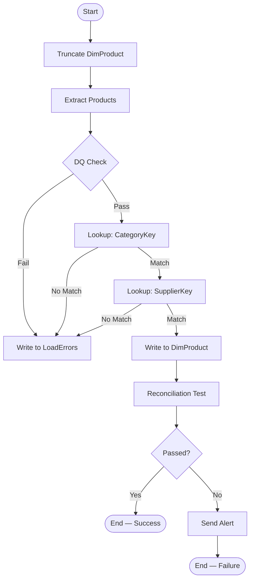
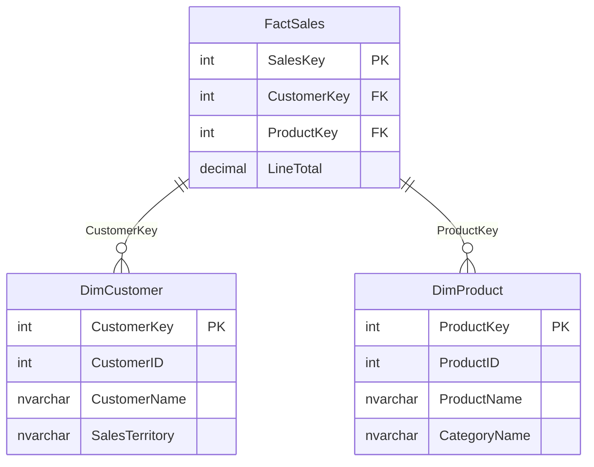

# Chapter 6: ETL Documentation — Data Dictionaries and Process Flows

> **ETL for Business Intelligence**
> *A practical guide to data provisioning, dimensional modelling, and pipeline design*
>
> © Patrick Dolinger, NSCC Institute of Technology
> Licensed under [Creative Commons Attribution 4.0 International (CC BY 4.0)](https://creativecommons.org/licenses/by/4.0/)
> You are free to share and adapt this material for any purpose, provided appropriate credit is given.

---

## Chapter Overview

The previous chapters have built a complete, tested ETL pipeline. This chapter addresses the work that makes that pipeline maintainable, auditable, and transferable: documentation.

Documentation is the most consistently undervalued activity in ETL development. It is easy to skip when deadlines press, easy to defer when the immediate problem is getting data to load, and easy to rationalize away when only one person knows the system. It is also the activity whose absence causes the most long-term damage — to system maintainability, to data trust, and to the organization's ability to onboard new team members or adapt to change.

This chapter approaches documentation not as a burden but as a professional discipline that pays compounding returns. A well-documented ETL system is faster to debug, safer to change, easier to hand off, and more likely to be trusted by the business users who depend on it.

By the end of this chapter you will be able to:

- Explain the purpose and components of a formal ETL design document
- Build a complete data dictionary for a dimensional model
- Draw process flow diagrams for ETL pipelines using standard notation
- Describe the components of a complete source-to-target mapping document
- Apply PMI-standard documentation practices to ETL design deliverables
- Use SQL queries to generate documentation artifacts directly from the system catalog
- Explain what makes documentation maintainable over the life of a system

---

## Table of Contents

1. [The Case for ETL Documentation](#1-the-case-for-etl-documentation)
2. [The ETL Design Document](#2-the-etl-design-document)
3. [The Data Dictionary](#3-the-data-dictionary)
4. [Process Flow Diagrams](#4-process-flow-diagrams)
5. [The Complete Source-to-Target Mapping](#5-the-complete-source-to-target-mapping)
6. [Documentation Standards and Formatting](#6-documentation-standards-and-formatting)
7. [Generating Documentation from the System Catalog](#7-generating-documentation-from-the-system-catalog)
8. [Keeping Documentation Current](#8-keeping-documentation-current)
9. [Chapter Summary](#9-chapter-summary)
10. [Review Questions](#10-review-questions)
11. [🔍 Deeper Dive](#-deeper-dive)

---

## 1. The Case for ETL Documentation

Before examining what good documentation looks like, it is worth understanding precisely what its absence costs.

### 1.1 The Undocumented ETL Tax

An ETL system without documentation imposes what practitioners call the **undocumented ETL tax** — a growing overhead of time and risk on every activity that involves the system:

**Debugging:** When a reconciliation test fails and the developer must find the cause, undocumented systems require reading every SQL expression, every SSIS component, every stored procedure to understand what the system was supposed to do. With documentation, the expected behaviour is stated; the actual behaviour can be compared immediately.

**Change management:** A business analyst requests that the `SalesTerritory` mapping be updated — Manitoba should move from 'Prairies' to 'Central Canada'. In a documented system this takes twenty minutes: find the mapping in the S2T document, update the transformation rule, update the SSIS expression, run the tests. In an undocumented system, the developer must first spend an hour finding where the CASE expression lives, then determine whether it appears in multiple places.

**Knowledge transfer:** A new developer joins the team. In a documented system, the ETL design document, data dictionary, and S2T mapping provide a complete mental model of the system within a day of reading. In an undocumented system, the new developer spends weeks reverse-engineering the system from package structures — and even then, the *intent* of design decisions may never be recoverable.

**Audit and compliance:** A regulator or auditor asks: "Show me exactly how revenue is calculated and where that data comes from." A documented system answers this question immediately from the S2T mapping and data dictionary. An undocumented system requires a multi-week forensic exercise.

**Trust:** Business users who cannot get a clear answer to "how is this number calculated?" will eventually stop trusting the BI system — regardless of whether the number is actually correct. Documentation makes correctness visible and verifiable.

### 1.2 Documentation as a Design Activity

The most effective documentation is written *during* design and *before* implementation, not as an afterthought. This is not merely a matter of efficiency — it is a matter of quality.

Writing the data dictionary before loading data forces precision about column meanings. Writing the S2T mapping before building the SSIS package surfaces gaps and ambiguities that would otherwise only be discovered during testing. Writing the process flow before coding reveals missing error paths and dependency violations.

The S2T mapping from Chapter 3 is already an example of this principle — it was developed before any ETL code was written, and every ETL decision in Chapters 3 and 4 was derived from it. This chapter formalizes that approach into a complete documentation framework.

---

## 2. The ETL Design Document

The **ETL Design Document** is the master reference for an ETL project. It collects all design decisions, specifications, and rationale in a single, structured deliverable. It is the document that a developer should be able to read and then build the ETL system — and the document that a new developer should be able to read and then maintain it.

### 2.1 Document Structure

A complete ETL Design Document has eight sections:

| Section | Content | Primary audience |
|---|---|---|
| 1. Executive Summary | Scope, objectives, key design decisions | Management, stakeholders |
| 2. Source System Analysis | Source schemas, row counts, date ranges, DQ findings | ETL developers, DBAs |
| 3. Target System Overview | DW/mart schema, all dims and facts with row estimates | ETL developers, BI developers |
| 4. Gap Analysis | All identified gaps with type, description, resolution | ETL developers, data stewards |
| 5. Source-to-Target Mapping | Complete column-level specification for all tables | ETL developers, QA analysts |
| 6. Data Quality Rules | Rule catalogue with SQL, severity, and results | ETL developers, data stewards |
| 7. Process Flow Diagrams | Visual ETL workflow for each fact table load | ETL developers, operations |
| 8. Testing Strategy | Test types, reconciliation metrics, pass/fail criteria | ETL developers, QA analysts |

### 2.2 Section 1: Executive Summary

The executive summary is written for readers who will not read the rest of the document. It states:

- **Scope:** What source systems are included, what target system is being loaded, what date range the data covers
- **Objectives:** What business questions the DW/mart is designed to answer
- **Architecture:** A one-paragraph description of the pipeline (OLTP → DW → data marts)
- **Key design decisions:** The three to five most important design choices and their rationale
- **Known limitations:** Gaps that were accepted (e.g., PostalCode not available), SCD Type choices, any data that is excluded and why

**CabotTrail Executive Summary example:**

> This document specifies the ETL design for `CabotTrailOutdoorDW`, a dimensional data warehouse loaded nightly from `CabotTrailOutdoor` (the operational OLTP system). The DW covers sales, purchasing, returns, inventory, and financial transaction data for the period 2022–2025, representing four years of business activity for CabotTrail Outdoor, a Nova Scotia-based outdoor gear retailer.
>
> The DW uses a Kimball-style star schema with 10 dimension tables and 6 fact tables. Five subject-specific data marts are derived from the DW for consumption by BI tools.
>
> **Key design decisions:**
> 1. Product cost is derived from `StandardCostPct` per product category (not from purchase order cost), producing realistic margin variation across 13 categories
> 2. All dimensions are SCD Type 1 (overwrite) — historical customer/product changes are not tracked in this version
> 3. The primary product category is resolved using MIN(ProductCategoryID) for products assigned to multiple categories
> 4. Open orders (2026, no invoices) are excluded from all fact tables
> 5. `SalesTerritory` is derived during ETL from province code — it does not exist in the OLTP

### 2.3 Section 2: Source System Analysis

The source system analysis summarizes the profiling work from Chapter 3. It should include:

**Schema inventory table:**

| Schema | Tables | Total rows | Date range | Key entities |
|---|---|---|---|---|
| Sales | 8 | ~35,000 | 2022–2026 | Customers, Orders, Invoices, Returns |
| Purchasing | 4 | ~2,000 | 2022–2026 | Suppliers, PurchaseOrders |
| Inventory | 4 | ~500 | Current snapshot | Products, Categories, Holdings |
| Application | 8 | ~300 | Reference data | Employees, Geography, Lookups |

**Data quality summary:** A condensed version of the DQ rule results, organized by severity:

| Severity | Rules checked | Passed | Failed |
|---|---|---|---|
| High | 8 | 8 | 0 |
| Medium | 4 | 3 | 1 |
| Low | 2 | 2 | 0 |

For any failed rules, describe the issue and how it was resolved.

### 2.4 Section 3: Target System Overview

The target system overview describes the DW schema that will be loaded. For each dimension and fact table, document:

- Table name and schema
- Grain (for facts) or entity description (for dimensions)
- Row count estimate
- Primary source tables
- Special design notes

```
Dimension.DimCustomer
  Description: One row per customer, sourced from Sales.Customers
               with geography flattened from Application.Cities/StateProvinces/Countries
  Rows: 100 (plus unknown member row)
  Source tables: Sales.Customers, Application.Cities, Application.StateProvinces,
                 Application.Countries
  Notes: SCD Type 1. SalesTerritory derived from ProvinceCode (not in OLTP).
         PostalCode not available in source — NULL.

Fact.FactSales
  Grain: One row per product on each customer invoice
  Rows: ~16,359
  Source tables: Sales.InvoiceLines, Sales.Invoices, Sales.Orders,
                 Sales.OrderLines, Inventory.ProductCategories
  Dimensions: DimDate (×3 roles), DimCustomer, DimProduct, DimEmployee,
              DimGeography, DimDeliveryMethod
  Notes: UnitCost derived from StandardCostPct × UnitPrice × PickedQuantity.
         GrossProfitMarginPct is non-additive — do not SUM.
         Excludes 2026 open orders (YEAR(OrderDate) < 2026).
```

---

## 3. The Data Dictionary

The **data dictionary** is the most referenced document in a BI environment. Analysts, developers, and business users consult it to understand what columns mean, where they come from, and how to use them correctly. A good data dictionary is not just a list of column names and types — it is a vocabulary for the business.

### 3.1 What a Complete Data Dictionary Contains

For every table and column in the DW and data marts, the data dictionary records:

| Field | Description | Example |
|---|---|---|
| **Schema** | Database schema | `Fact` |
| **Table** | Table name | `FactSales` |
| **Column** | Column name | `GrossProfitMarginPct` |
| **Data type** | SQL Server data type with precision | `DECIMAL(8,2)` |
| **Nullable** | Whether NULL is permitted | `NOT NULL` |
| **Default** | Default value if any | None |
| **Key type** | PK, FK, or blank | FK |
| **Source** | Origin (table.column or derivation) | Computed from GrossProfit / LineTotal |
| **Business description** | Plain-language meaning | Gross profit as a percentage of revenue for this invoice line. Computed as (LineTotal − UnitCost) / LineTotal × 100. **Non-additive — never sum this column.** Use SUM(GrossProfit) / SUM(LineTotal) × 100 for aggregate margin. |
| **Usage notes** | How to use correctly; common mistakes | Always compute aggregate margin from GrossProfit and LineTotal, not by averaging this column |
| **DQ rules** | Which rules apply | DQ-009: GrossProfit ≥ 0 |

The **business description** and **usage notes** are the columns that require business stakeholder input. They cannot be generated from the system catalog — they must be written by a human who understands what the data means.

### 3.2 The Data Dictionary as a SQL Query

The technical portion of the data dictionary can be generated directly from the system catalog. This ensures it is always accurate and never becomes stale due to schema changes:

```sql
-- Generate the technical data dictionary for the DW
USE CabotTrailOutdoorDW;

SELECT
    s.name                              AS [Schema],
    t.name                              AS [Table],
    c.name                              AS [Column],
    -- Full data type with precision/scale
    tp.name +
    CASE
        WHEN tp.name IN ('nvarchar','varchar','char','nchar')
            AND c.max_length > 0
        THEN '(' + CAST(
                CASE WHEN tp.name IN ('nvarchar','nchar')
                     THEN c.max_length / 2
                     ELSE c.max_length END
             AS VARCHAR) + ')'
        WHEN tp.name IN ('nvarchar','varchar')
            AND c.max_length = -1
        THEN '(MAX)'
        WHEN tp.name IN ('decimal','numeric')
        THEN '(' + CAST(c.precision AS VARCHAR) + ',' + CAST(c.scale AS VARCHAR) + ')'
        ELSE ''
    END                                 AS [DataType],
    CASE c.is_nullable WHEN 1 THEN 'NULL' ELSE 'NOT NULL' END AS [Nullable],
    -- Key type
    CASE
        WHEN pk.column_id IS NOT NULL THEN 'PK'
        WHEN fk.parent_column_id IS NOT NULL THEN 'FK'
        ELSE ''
    END                                 AS [KeyType],
    -- Referenced table for FK columns
    CASE WHEN fk.parent_column_id IS NOT NULL
         THEN ref_s.name + '.' + ref_t.name + '.' + ref_c.name
         ELSE ''
    END                                 AS [References],
    -- Computed column flag
    CASE c.is_computed WHEN 1 THEN 'Computed' ELSE '' END AS [Computed],
    -- Column ordinal position for ordering
    c.column_id                         AS [Position]
FROM    sys.tables t
INNER JOIN sys.schemas s        ON s.schema_id   = t.schema_id
INNER JOIN sys.columns c        ON c.object_id   = t.object_id
INNER JOIN sys.types tp         ON tp.user_type_id = c.user_type_id
-- PK detection
LEFT JOIN (
    SELECT  ic.object_id, ic.column_id
    FROM    sys.index_columns ic
    INNER JOIN sys.indexes i ON i.object_id = ic.object_id
                             AND i.index_id = ic.index_id
                             AND i.is_primary_key = 1
) pk ON pk.object_id = t.object_id AND pk.column_id = c.column_id
-- FK detection
LEFT JOIN sys.foreign_key_columns fk
    ON fk.parent_object_id = t.object_id AND fk.parent_column_id = c.column_id
LEFT JOIN sys.tables ref_t
    ON ref_t.object_id = fk.referenced_object_id
LEFT JOIN sys.schemas ref_s
    ON ref_s.schema_id = ref_t.schema_id
LEFT JOIN sys.columns ref_c
    ON ref_c.object_id = fk.referenced_object_id
    AND ref_c.column_id = fk.referenced_column_id
WHERE   s.name IN ('Dimension', 'Fact', 'ETL')
ORDER BY s.name, t.name, c.column_id;
```

This query produces the technical skeleton of the data dictionary. Export it to Excel or a documentation tool and add the business description and usage notes columns manually.

### 3.3 Extended Properties: Storing Descriptions in the Database

SQL Server supports **extended properties** — metadata stored directly in the database, attached to any database object (table, column, index, schema). They provide a way to store business descriptions alongside the schema definition, making them accessible to documentation tools:

```sql
-- Add a business description to a column using extended properties
EXEC sys.sp_addextendedproperty
    @name       = N'MS_Description',
    @value      = N'Gross profit as a percentage of revenue for this invoice line.
                    Computed as (LineTotal - UnitCost) / LineTotal * 100.
                    NON-ADDITIVE: never sum this column.
                    Always compute aggregate margin as SUM(GrossProfit) / SUM(LineTotal) * 100.',
    @level0type = N'SCHEMA',  @level0name = N'Fact',
    @level1type = N'TABLE',   @level1name = N'FactSales',
    @level2type = N'COLUMN',  @level2name = N'GrossProfitMarginPct';

-- Update an existing extended property
EXEC sys.sp_updateextendedproperty
    @name       = N'MS_Description',
    @value      = N'[Updated description]',
    @level0type = N'SCHEMA',  @level0name = N'Fact',
    @level1type = N'TABLE',   @level1name = N'FactSales',
    @level2type = N'COLUMN',  @level2name = N'GrossProfitMarginPct';

-- Query all extended properties: generate data dictionary with descriptions
SELECT
    s.name          AS [Schema],
    t.name          AS [Table],
    c.name          AS [Column],
    ep.value        AS [Description]
FROM    sys.extended_properties ep
INNER JOIN sys.columns c  ON c.object_id  = ep.major_id
                         AND c.column_id  = ep.minor_id
INNER JOIN sys.tables t   ON t.object_id  = c.object_id
INNER JOIN sys.schemas s  ON s.schema_id  = t.schema_id
WHERE   ep.name = 'MS_Description'
AND     ep.class = 1    -- Column-level properties
ORDER BY s.name, t.name, c.column_id;
```

Extended properties are preserved through database backups and restores. Tools like SSMS, Azure Data Studio, and many third-party documentation generators read `MS_Description` extended properties automatically.

### 3.4 Data Dictionary Entries for Key CabotTrail Columns

The following entries illustrate the depth expected for a production data dictionary. Each entry combines technical precision with business-meaningful description:

---

**`Fact.FactSales.GrossProfitMarginPct`**
- **Data type:** `DECIMAL(8,2) NOT NULL`
- **Source:** Computed — `(LineTotal − UnitCost) / LineTotal × 100`
- **Business description:** Gross profit expressed as a percentage of revenue for this individual invoice line. Computed during ETL using `StandardCostPct` per product category. For example, a Sleeping Bag line with LineTotal = $249.99 and UnitCost = $167.49 has GrossProfitMarginPct = 33.0%.
- **Usage notes:** **This measure is non-additive — do not use SUM(GrossProfitMarginPct).** To compute aggregate margin, always use `SUM(GrossProfit) / SUM(LineTotal) × 100`. Averaging this column also produces incorrect results because it weights all lines equally regardless of value.
- **DQ rules:** Must satisfy `LineTotal >= UnitCost` (if violated, margin is negative — investigate source data)

---

**`Dimension.DimCustomer.SalesTerritory`**
- **Data type:** `NVARCHAR(60) NULL`
- **Source:** Derived — CASE expression on `Application.StateProvinces.StateProvinceCode` during ETL load
- **Business description:** Regional grouping assigned to each customer based on their delivery province. Values: 'Atlantic — Nova Scotia', 'Atlantic — New Brunswick', 'Atlantic — PEI', 'Atlantic — Newfoundland', 'Quebec', 'Ontario', 'Prairies', 'Alberta', 'British Columbia'. Customers with unrecognized province codes receive 'Other'.
- **Usage notes:** This attribute does not exist in the OLTP system — it is derived during ETL. If the territory mapping needs to change, the S2T mapping document must be updated and the ETL redeployed.
- **DQ rules:** NULL indicates a customer whose DeliveryCityID could not be resolved to a province — investigate the geography hierarchy

---

**`Fact.FactInventory.QuantityOnHand`**
- **Data type:** `INT NOT NULL`
- **Source:** `Inventory.ProductHoldings.QuantityOnHand`
- **Business description:** Number of units of this product in stock as of the snapshot date. Sourced from the most recent physical stocktake recorded in `ProductHoldings.LastStocktakeDate`.
- **Usage notes:** **Semi-additive** — can be summed across products (total units in stock) but NOT across snapshot dates (which would double-count inventory). If this table is loaded with multiple snapshots, use `MAX(SnapshotDate)` to filter to the current snapshot before summing. Currently loaded as a single snapshot per product.
- **DQ rules:** Must be ≥ 0

---

## 4. Process Flow Diagrams

A **process flow diagram** is a visual representation of an ETL pipeline — what happens, in what order, under what conditions, and what happens when things go wrong. It is the visual complement to the S2T mapping's column-level specification.

### 4.1 Standard Process Flow Notation

Process flows use a standardized symbol set. BPMN (Business Process Model and Notation) is the most widely used formal standard, but ETL process flows typically use a simplified subset:

| Symbol | Shape | Represents |
|---|---|---|
| **Start / End** | Rounded rectangle (oval) | The beginning or end of the process |
| **Process step** | Rectangle | A single ETL operation |
| **Decision** | Diamond | A conditional branch (Yes/No, Pass/Fail) |
| **Data store** | Cylinder | A database table (source or target) |
| **Document** | Rectangle with wavy bottom | A file (CSV, Excel) |
| **Manual operation** | Trapezoid | A step requiring human intervention |
| **Flow arrow** | Directed arrow | Direction of execution |
| **Annotation** | Dashed bracket with text | Notes on a step |

> **Rule:** Every decision diamond must have exactly two exit paths, each labelled. A decision with only one exit path is a logic error — what happens in the other case?

### 4.2 Process Flow for Load_DimProduct.dtsx

```
( START )
    |
    v
[ Truncate Dimension.DimProduct ]
    |
    v
[ Extract: JOIN Products + Colors + PackageTypes + PrimaryCategoryAssignment ]
    |
    v
< DQ Check: ProductID <> 0 AND UnitPrice > 0 >
    |Yes                    |No
    v                       v
[ Lookup:                [ Write to ETL.LoadErrors ]
  ProductCategoryID         |
  → ProductCategoryKey ]    v
    |Match    |No Match  ( FAIL PATH — log and continue )
    v         v
    |    [ Write to ETL.LoadErrors: 'No match in DimProductCategory' ]
    v
[ Lookup:
  SupplierID
  → SupplierKey ]
    |Match    |No Match
    v         v
    |    [ Write to ETL.LoadErrors: 'No match in DimSupplier' ]
    v
[ Write to Dimension.DimProduct ]
    |
    v
[ Run Reconciliation Test:
  DimProduct row count vs source ]
    |
    v
< Test Passed? >
    |Yes                 |No
    v                    v
[ Record PASS        [ Record FAIL in ETL.TestResults ]
  in ETL.TestResults ]     |
    |                    [ Send alert: ETL.usp_SendLoadAlert ]
    v                        |
( END — Success )       ( END — Failure )
```

### 4.3 Process Flow for Load_FactSales.dtsx

The fact table load is more complex — it has eight lookup transformations, each with an error path:

```
( START )
    |
    v
[ Truncate Fact.FactSales ]
    |
    v
[ Extract: JOIN InvoiceLines + Invoices + Orders + OrderLines +
           Customers + PrimaryCategoryAssignment + ProductCategories ]
    |
    v
< DQ Checks: UnitPrice > 0 AND Quantity > 0 AND InvoiceID NOT NULL >
    |Pass                     |Fail
    v                         v
[ Lookup: CustomerID        [ Write to ETL.LoadErrors ]
  → CustomerKey ]
    |Match    |No Match
    v         v
    |    [ Write to ETL.LoadErrors ]
    v
[ Lookup: ProductID → ProductKey ] → (error path as above)
    |
[ Lookup: EmployeeID → EmployeeKey ] → (error path as above)
    |
[ Lookup: CityID → GeographyKey ] → (error path as above)
    |
[ Lookup: DeliveryMethodID → DeliveryMethodKey ] → (error path as above)
    |
[ Lookup: OrderDateKey → validate in DimDate ] → (error path as above)
    |
[ Lookup: InvoiceDateKey → validate in DimDate ] → (error path as above)
    |
[ Lookup: DueDateKey → validate in DimDate ] → (error path as above)
    |
    v
[ Write to Fact.FactSales ]
    |
    v
[ Run Reconciliation Test: Row count ]
[ Run Reconciliation Test: Revenue sum ]
[ Run Reconciliation Test: Orphan check ]
    |
    v
< All Tests Passed? >
    |Yes                  |No
    v                     v
( END — Success )    [ Send alert ] → ( END — Failure )
```

### 4.4 Process Flow for Master_DW_Load.dtsx

The master package process flow shows the dependency structure across all packages:

```
( START — Nightly 2:00 AM )
    |
    v
[ Record Load Run Start in ETL.LoadRuns ]
    |
    v
┌─────────────────────────────────────────────────┐
│ TIER 1 (Parallel):                              │
│  [Load DimDate] [Load DimDeliveryMethod]        │
│  [Load DimTransactionType] [Load DimPaymentMethod]│
│  [Load DimProductCategory]                      │
└──────────────────────┬──────────────────────────┘
                       | All Tier 1 succeeded
                       v
          [ Load DimGeography ]
                       |
                       v
┌─────────────────────────────────────────────────┐
│ TIER 3 (Parallel):                              │
│  [Load DimCustomer]                             │
│  [Load DimSupplier]                             │
│  [Load DimEmployee]                             │
└──────────────────────┬──────────────────────────┘
                       | All Tier 3 succeeded
                       v
          [ Load DimProduct ]
                       |
                       v
┌─────────────────────────────────────────────────┐
│ TIER 5 (Parallel):                              │
│  [Load FactSales]  [Load FactPurchasing]        │
│  [Load FactReturns] [Load FactInventory]        │
│  [Load FactCustomerTransactions]                │
│  [Load FactSupplierTransactions]                │
└──────────────────────┬──────────────────────────┘
                       |
                       v
        [ Run Full Test Suite Summary ]
                       |
                       v
        < Any Tests Failed? >
           |No              |Yes
           v                v
  [ Update LoadRuns:   [ Update LoadRuns: Failed ]
    Passed ]           [ Send Alert Email ]
           |                |
           v                v
     ( END — Success ) ( END — Failure )
```

### 4.5 Swimlane Diagrams

For processes that involve multiple systems or teams, a **swimlane diagram** adds a vertical or horizontal partitioning layer showing which actor or system is responsible for each step:

```
     OLTP System          ETL Pipeline            DW / Data Mart
    ─────────────        ─────────────           ──────────────────
                    →   [ Extract from OLTP ]
    [ OLTP tables ] →          |
                         [ Transform ]
                               |
                               ├──────────────→ [ DimCustomer ]
                               ├──────────────→ [ DimProduct ]
                               └──────────────→ [ FactSales ]
                                                       |
                                          [ Reconciliation tests ]
                                                       |
                                               < Tests pass? >
                                               |Yes        |No
                                               ↓           ↓
                                          [ Data mart  [ Alert +
                                            refresh ]   hold mart ]
```

Swimlane diagrams are particularly useful for communicating ETL architecture to non-technical stakeholders — they make the system boundary between OLTP and DW visible.

---

## 5. The Complete Source-to-Target Mapping

The S2T mapping was introduced in Chapter 3 as a design tool. This section describes what makes a mapping document *complete* — ready to serve as a specification, a test oracle, and an audit trail.

### 5.1 Completeness Criteria

An S2T mapping is complete when:

1. **Every target column has a row** — no column is left undocumented
2. **Every transformation rule is unambiguous** — a developer who has never seen the system can implement it from the rule alone, without asking questions
3. **All gaps are documented** — missing data, data quality issues, and structural gaps are explicitly noted with their agreed resolution
4. **Load order dependencies are shown** — the document makes clear which tables must be loaded before which
5. **Non-additive measures are flagged** — every measure whose aggregation behaviour is not straightforward must be explicitly labelled
6. **SCD type is stated** — for every dimension, the SCD handling strategy is documented
7. **Test references are included** — each column references the DQ rules and reconciliation tests that verify it

### 5.2 Transformation Rule Precision

The transformation rule column is where most S2T mappings fall short. Vague rules produce inconsistent implementations. Every rule must be precise enough that two developers, working independently, produce identical SSIS expressions.

**Imprecise rule (insufficient):**
```
SalesTerritory: Derived from province
```

**Precise rule (sufficient):**
```
SalesTerritory: CASE StateProvinceCode
    WHEN 'NS' THEN 'Atlantic — Nova Scotia'
    WHEN 'NB' THEN 'Atlantic — New Brunswick'
    WHEN 'PE' THEN 'Atlantic — PEI'
    WHEN 'NL' THEN 'Atlantic — Newfoundland'
    WHEN 'QC' THEN 'Quebec'
    WHEN 'ON' THEN 'Ontario'
    WHEN 'MB' THEN 'Prairies'
    WHEN 'SK' THEN 'Prairies'
    WHEN 'AB' THEN 'Alberta'
    WHEN 'BC' THEN 'British Columbia'
    ELSE 'Other'
END
Source of StateProvinceCode: Application.StateProvinces.StateProvinceCode,
joined via Application.Cities.StateProvinceID → Application.StateProvinces.StateProvinceID
and Customers.DeliveryCityID → Application.Cities.CityID
```

**Imprecise rule (insufficient):**
```
UnitCost: Computed from category cost rate
```

**Precise rule (sufficient):**
```
UnitCost: ROUND(il.UnitPrice × pcat.StandardCostPct × ol.PickedQuantity, 2)
Where:
  il.UnitPrice = Sales.InvoiceLines.UnitPrice
  pcat.StandardCostPct = Inventory.ProductCategories.StandardCostPct
  ol.PickedQuantity = Sales.OrderLines.PickedQuantity
  pcat is joined via primary category: MIN(ProductCategoryID) per ProductID
  from Inventory.ProductCategoryAssignments
```

### 5.3 The S2T Mapping as a Spreadsheet

The S2T mapping is typically maintained as an Excel spreadsheet with one worksheet per target table. A complete workbook for CabotTrail would have:

| Worksheet | Content |
|---|---|
| `00_Index` | Table of contents with links to each sheet; load order; SCD summary |
| `01_DimDate` | S2T mapping for DimDate |
| `02_DimGeography` | S2T mapping for DimGeography |
| `03_DimCustomer` | S2T mapping for DimCustomer |
| `04_DimProduct` | S2T mapping for DimProduct |
| `05_DimSupplier` | S2T mapping for DimSupplier |
| `06_DimEmployee` | S2T mapping for DimEmployee |
| `07_DimDeliveryMethod` | S2T mapping for DimDeliveryMethod |
| `08_DimTransactionType` | S2T mapping for DimTransactionType |
| `09_DimPaymentMethod` | S2T mapping for DimPaymentMethod |
| `10_DimProductCategory` | S2T mapping for DimProductCategory |
| `11_FactSales` | S2T mapping for FactSales |
| `12_FactPurchasing` | S2T mapping for FactPurchasing |
| `13_FactReturns` | S2T mapping for FactReturns |
| `14_FactInventory` | S2T mapping for FactInventory |
| `15_FactCustomerTransactions` | S2T mapping for FactCustomerTransactions |
| `16_FactSupplierTransactions` | S2T mapping for FactSupplierTransactions |
| `Gaps` | All identified gaps with type and resolution |
| `DQ_Rules` | Complete DQ rule catalogue |

### 5.4 Load Order Index (Worksheet 00_Index)

The index worksheet documents the dependency chain that governs load order in the master package:

| Load order | Package | Depends on | SCD type | Est. rows |
|---|---|---|---|---|
| 1 | Load_DimDate | None | Static | 4,017 |
| 2 | Load_DimDeliveryMethod | None | Static | 12 |
| 3 | Load_DimTransactionType | None | Static | varies |
| 4 | Load_DimPaymentMethod | None | Static | varies |
| 5 | Load_DimProductCategory | None | Static | 13 |
| 6 | Load_DimGeography | None | Type 1 | varies |
| 7 | Load_DimCustomer | DimGeography | Type 1 | 100 |
| 8 | Load_DimSupplier | DimGeography | Type 1 | varies |
| 9 | Load_DimEmployee | None | Type 1 | 50 |
| 10 | Load_DimProduct | DimProductCategory, DimSupplier | Type 1 | 142 |
| 11 | Load_FactSales | All dims | N/A | 16,359 |
| 12 | Load_FactPurchasing | All dims | N/A | 905 |
| 13 | Load_FactReturns | All dims | N/A | 500 |
| 14 | Load_FactInventory | DimDate, DimProduct, DimSupplier, DimProductCategory | N/A | 142 |
| 15 | Load_FactCustomerTransactions | DimDate, DimCustomer, DimTransactionType, DimEmployee | N/A | 9,346 |
| 16 | Load_FactSupplierTransactions | DimDate, DimSupplier, DimTransactionType, DimEmployee | N/A | 240 |

---

## 6. Documentation Standards and Formatting

Professional ETL documentation follows standards that make it consistent, readable, and maintainable. The PMI (Project Management Institute) standard is widely used in enterprise environments.

### 6.1 PMI Document Standards

**Document header:** Every document begins with a header block containing:
- Document title
- Project name
- Author(s)
- Version number
- Date created / last revised
- Status (Draft / Under Review / Approved)
- Approved by (when applicable)

**Version history table:** Below the header, a table recording every significant revision:

| Version | Date | Author | Description of changes |
|---|---|---|---|
| 0.1 | 2027-01-06 | P. Dolinger | Initial draft — source analysis and gap analysis complete |
| 0.2 | 2027-01-15 | P. Dolinger | S2T mapping complete for all dimensions |
| 0.3 | 2027-01-22 | P. Dolinger | S2T mapping complete for all facts; DQ rules added |
| 1.0 | 2027-02-12 | P. Dolinger | Final version — all sections complete; approved by J. Smith |

**Table of contents:** Auto-generated from headers in Word or Google Docs. Required for documents over 5 pages.

**Consistent heading hierarchy:** Use heading levels consistently — H1 for major sections, H2 for subsections, H3 for sub-subsections. Never skip a level.

**Page numbers and section references:** All pages numbered; section references in cross-references (e.g., "see Section 5.3").

### 6.2 Naming Conventions

Consistent naming makes a documentation set navigable:

**Document files:**
```
CabotTrail_ETL_DesignDocument_v1.0.pdf
CabotTrail_S2T_Mapping_v1.0.xlsx
CabotTrail_DataDictionary_v1.0.xlsx
CabotTrail_DW_ERD_v1.0.pdf
```

**Section names in the S2T mapping:** Match the database object names exactly — no abbreviations, no alternate spellings. `Fact.FactSales` in the database means the worksheet is titled `Fact.FactSales`, not "Sales Fact" or "FactSales".

**Column names in documentation:** Quote column names in backticks or monospace font to distinguish them from prose text: "`GrossProfitMarginPct` is a non-additive measure."

### 6.3 Writing for Multiple Audiences

An ETL Design Document is read by at least three distinct audiences who have different needs:

**Business stakeholders** (executives, data stewards): Read Section 1 (Executive Summary) and the business descriptions in the data dictionary. Write for them: avoid jargon, lead with business impact, explain decisions in business terms.

**ETL developers**: Read Sections 2–8 in full; use the S2T mapping as a daily reference during implementation. Write for them: be technically precise, include complete SQL expressions, document all edge cases.

**BI developers and analysts**: Read the data dictionary and the target system overview. Write for them: explain how to use each measure correctly, identify common misuse patterns, provide example queries.

The same fact — that `GrossProfitMarginPct` is non-additive — needs to be communicated differently to each audience:

**For business stakeholders:** "Total company margin must be calculated as total profit divided by total revenue — adding up individual line margins would produce an incorrect result."

**For ETL developers:** "`GrossProfitMarginPct DECIMAL(8,2)` — non-additive. Computed as `ROUND((LineTotal - UnitCost) / NULLIF(LineTotal, 0) * 100, 2)`. Stored for convenience; not to be aggregated. Document in data dictionary with usage warning."

**For BI developers:** "Do not use `SUM(GrossProfitMarginPct)` or `AVG(GrossProfitMarginPct)`. To compute company-wide margin: `SUM(GrossProfit) / SUM(LineTotal) * 100`. To compute margin by product category: `SUM(GrossProfit) / SUM(LineTotal) * 100 GROUP BY CategoryName`."

---

## 7. Generating Documentation from the System Catalog

The most reliable documentation is documentation that is generated from the system itself — it cannot become out of sync with reality because it is derived from reality. SQL Server's system catalog provides the raw material for several documentation artifacts.

### 7.1 Entity-Relationship Diagram Data

The FK relationships in the system catalog can be extracted to provide the data for an ERD. While SQL Server cannot draw the ERD itself, the relationship data drives any diagramming tool:

```sql
-- Extract all relationships for ERD generation
SELECT
    s_parent.name       AS ParentSchema,
    t_parent.name       AS ParentTable,
    c_parent.name       AS ParentColumn,
    s_child.name        AS ChildSchema,
    t_child.name        AS ChildTable,
    c_child.name        AS ChildColumn,
    fk.name             AS RelationshipName,
    -- Cardinality is always 1 (PK side) → Many (FK side) in normalized design
    '1'                 AS ParentCardinality,
    'M'                 AS ChildCardinality
FROM    sys.foreign_keys fk
INNER JOIN sys.foreign_key_columns fkc
    ON fkc.constraint_object_id = fk.object_id
-- Child table (FK side)
INNER JOIN sys.tables t_child   ON t_child.object_id  = fkc.parent_object_id
INNER JOIN sys.schemas s_child  ON s_child.schema_id  = t_child.schema_id
INNER JOIN sys.columns c_child  ON c_child.object_id  = fkc.parent_object_id
                               AND c_child.column_id  = fkc.parent_column_id
-- Parent table (PK side)
INNER JOIN sys.tables t_parent  ON t_parent.object_id = fkc.referenced_object_id
INNER JOIN sys.schemas s_parent ON s_parent.schema_id = t_parent.schema_id
INNER JOIN sys.columns c_parent ON c_parent.object_id = fkc.referenced_object_id
                               AND c_parent.column_id = fkc.referenced_column_id
ORDER BY s_parent.name, t_parent.name, s_child.name, t_child.name;
```

### 7.2 Index Inventory

Documenting existing indexes helps future developers understand the performance design decisions and avoids duplicate or conflicting index creation:

```sql
-- Index inventory: what indexes exist and what columns they cover
SELECT
    s.name                          AS [Schema],
    t.name                          AS [Table],
    i.name                          AS [IndexName],
    i.type_desc                     AS [IndexType],
    CASE i.is_primary_key   WHEN 1 THEN 'Yes' ELSE 'No' END AS [IsPK],
    CASE i.is_unique        WHEN 1 THEN 'Yes' ELSE 'No' END AS [IsUnique],
    STRING_AGG(c.name, ', ')
        WITHIN GROUP (ORDER BY ic.key_ordinal)  AS [IndexColumns],
    -- Include columns (non-key columns in a covering index)
    STRING_AGG(
        CASE WHEN ic.is_included_column = 1 THEN c.name ELSE NULL END, ', ')
        WITHIN GROUP (ORDER BY ic.index_column_id) AS [IncludedColumns]
FROM    sys.indexes i
INNER JOIN sys.tables t     ON t.object_id  = i.object_id
INNER JOIN sys.schemas s    ON s.schema_id  = t.schema_id
INNER JOIN sys.index_columns ic ON ic.object_id = i.object_id
                               AND ic.index_id  = i.index_id
INNER JOIN sys.columns c    ON c.object_id  = ic.object_id
                           AND c.column_id  = ic.column_id
WHERE   i.type > 0          -- Exclude heaps (tables with no clustered index)
AND     s.name IN ('Dimension', 'Fact', 'ETL')
GROUP BY s.name, t.name, i.name, i.type_desc, i.is_primary_key, i.is_unique
ORDER BY s.name, t.name, i.name;
```

### 7.3 Row Count and Freshness Report

A living documentation artifact — generated on demand to show the current state of every DW table:

```sql
-- DW state snapshot: row counts and last load time
SELECT
    s.name                  AS [Schema],
    t.name                  AS [Table],
    p.rows                  AS [RowCount],
    -- Last update from ETL.TestResults
    ISNULL(
        CAST(MAX(tr.RunDate) AS NVARCHAR),
        'Never loaded'
    )                       AS [LastLoadTime],
    ISNULL(
        CAST(DATEDIFF(HOUR, MAX(tr.RunDate), GETDATE()) AS NVARCHAR) + ' hours ago',
        'N/A'
    )                       AS [DataAge]
FROM    sys.tables t
INNER JOIN sys.schemas s    ON s.schema_id = t.schema_id
INNER JOIN sys.partitions p ON p.object_id = t.object_id
                           AND p.index_id IN (0, 1)
LEFT JOIN CabotTrailOutdoorDW.ETL.TestResults tr
    ON tr.TargetTable = s.name + '.' + t.name
    AND tr.TestCategory = 'RowCount'
    AND tr.Passed = 1
WHERE   s.name IN ('Dimension', 'Fact')
GROUP BY s.name, t.name, p.rows
ORDER BY s.name, t.name;
```

---

## 8. Keeping Documentation Current

Documentation that is accurate on the day it is written but never updated becomes more dangerous than no documentation at all — a developer who trusts stale documentation makes decisions based on incorrect information.

### 8.1 The Documentation Change Process

Every change to the ETL system must be accompanied by a corresponding change to the documentation. This is a process requirement, not a good-intention aspiration. The process:

1. **Change request received** (new column, changed business rule, new source table)
2. **S2T mapping updated first** — the specification changes before the code
3. **Code change implemented** from the updated specification
4. **Tests updated** to reflect the new expected behaviour
5. **Data dictionary updated** with new column descriptions or changed descriptions
6. **Process flow diagrams updated** if the pipeline structure changed
7. **Version number incremented** in the document header
8. **Version history updated** with a description of the change

Steps 1–5 must happen for every change. Steps 6–7 are required for structural changes (new packages, new dependencies). Steps 8 is always required.

### 8.2 Documentation Reviews

Schedule periodic documentation reviews — at minimum once per quarter — to verify that documentation matches reality:

```sql
-- Generate a comparison: documented row counts vs actual row counts
-- (Documentation claims vs system reality)
-- This query assumes documented expected counts are stored in ETL.TestResults

SELECT
    tr.TargetTable,
    CAST(tr.ExpectedValue AS INT)                   AS DocumentedCount,
    p.rows                                          AS ActualCount,
    CAST(tr.ExpectedValue AS INT) - p.rows          AS Discrepancy
FROM (
    SELECT TargetTable, ExpectedValue,
           ROW_NUMBER() OVER (PARTITION BY TargetTable ORDER BY RunDate DESC) AS rn
    FROM   CabotTrailOutdoorDW.ETL.TestResults
    WHERE  TestCategory = 'RowCount' AND Passed = 1
) tr
INNER JOIN sys.tables t     ON t.name = PARSENAME(tr.TargetTable, 1)
INNER JOIN sys.schemas s    ON s.schema_id = t.schema_id
                           AND s.name = PARSENAME(tr.TargetTable, 2)
INNER JOIN sys.partitions p ON p.object_id = t.object_id
                           AND p.index_id IN (0, 1)
WHERE tr.rn = 1
ORDER BY ABS(CAST(tr.ExpectedValue AS INT) - p.rows) DESC;
```

### 8.3 Documentation as Code

The most maintainable documentation is documentation that lives alongside the code, in the same version control system, and changes are tracked together. **Docs-as-code** approaches maintain documentation in Markdown or similar text formats in a Git repository:

```
etl-cabot-trail/
├── docs/
│   ├── design-document.md          ← ETL Design Document in Markdown
│   ├── data-dictionary.md          ← Data Dictionary
│   ├── s2t-mapping/
│   │   ├── dim-customer.md         ← One file per mapping
│   │   ├── dim-product.md
│   │   └── fact-sales.md
│   └── process-flows/
│       ├── master-package-flow.md  ← Process flows in Markdown/Mermaid
│       └── fact-sales-flow.md
├── packages/
│   ├── Load_DimCustomer.dtsx
│   └── Load_FactSales.dtsx
└── sql/
    ├── ddl/
    └── reconciliation/
```

GitHub and GitLab render Markdown natively, making this approach particularly effective when the repository is hosted there. Process flow diagrams can be maintained as **Mermaid diagrams** — a text-based diagramming syntax that renders in GitHub Markdown:

```

```

This kind of diagram renders directly in GitHub as a visual flowchart, making the repository itself a navigable documentation portal.

---

## 9. Chapter Summary

- **ETL documentation** is a professional discipline with compounding returns — it makes systems faster to debug, safer to change, easier to hand off, and more likely to be trusted. Its absence imposes the **undocumented ETL tax** on every subsequent activity.

- The **ETL Design Document** has eight sections covering the executive summary, source analysis, target overview, gap analysis, S2T mapping, data quality rules, process flows, and testing strategy. It is written before implementation begins and maintained throughout the system's life.

- The **data dictionary** records every column in the DW and data marts with technical definition, source, business description, usage notes, and DQ rule references. Business descriptions cannot be auto-generated — they require business stakeholder input. Extended properties store descriptions inside the database.

- **Process flow diagrams** use standard notation (oval=start/end, rectangle=process, diamond=decision, cylinder=data store) to visualize ETL pipelines. Every decision must have two labeled exit paths. Error paths are as important as success paths.

- The **S2T mapping** is complete only when every target column is documented with an unambiguous transformation rule. Vague rules produce inconsistent implementations.

- **PMI documentation standards** — version history, document headers, table of contents, consistent heading hierarchy — make documents professional, navigable, and trustworthy.

- The **system catalog** provides auto-generated technical metadata (column types, FK relationships, indexes) that can be extracted with SQL queries. This portion of the data dictionary cannot become stale. Business descriptions require human input and must be maintained manually.

- **Keeping documentation current** requires a formal change process: specification changes before code, followed by code, tests, and documentation updates in sequence. Docs-as-code in a Git repository is the most maintainable approach.

---

## 10. Review Questions

1. Explain the "undocumented ETL tax" using a specific scenario from the CabotTrail environment. Choose one of the four cost categories (debugging, change management, knowledge transfer, audit/compliance) and describe concretely what would be required without documentation.

2. A colleague argues that "the code is the documentation" — the SSIS packages are self-documenting because you can read the component configuration to understand what they do. Identify two specific situations where this argument fails, using examples from the CabotTrail ETL.

3. Write a complete data dictionary entry for `Fact.FactSales.DaysUntilInvoice` — the computed column that measures days between order date and invoice date. Include all fields from the data dictionary template (data type, source, business description, usage notes, DQ rules).

4. Draw a process flow diagram for `Load_DimCustomer.dtsx` using the standard notation described in this chapter. Include: the extract from three source tables, a DQ check for NULL CustomerID, the write to DimCustomer, and a reconciliation test with success and failure paths.

5. The S2T mapping for `FactSales.UnitCost` has the transformation rule: "Derived from category cost." A developer implements this as `UnitPrice * 0.55`. Why is the mapping's rule insufficient? Write a precise rule that would prevent this incorrect implementation.

6. Explain why it is important that the S2T mapping be updated *before* the SSIS package is modified when a business rule changes. What risk arises when code is changed first and documentation is updated afterward?

7. The data dictionary lists `Fact.FactInventory.QuantityOnHand` as semi-additive. A Power BI developer creates a report that shows total `QuantityOnHand` summed over a date range (January through March 2024). Write the explanation you would include in the data dictionary usage notes to prevent this mistake, and describe the correct approach.

8. Describe the "docs-as-code" approach to ETL documentation. What specific advantages does storing documentation in a Git repository alongside the SSIS packages provide, compared to storing the documentation in a shared network folder?

---

## 🔍 Deeper Dive

### Going Further with ETL Documentation

#### The TOGAF Architecture Documentation Framework

**TOGAF** (The Open Group Architecture Framework) is an enterprise architecture methodology that includes formal standards for documenting architecture components, including data architecture. TOGAF's Architecture Description concepts — viewpoints, views, and stakeholders — provide a framework for producing documentation that addresses multiple audiences systematically.

For ETL and data warehouse projects, TOGAF's **Data Architecture** domain is directly relevant. It defines:
- The **Data Entity / Data Component Catalog** (equivalent to the data dictionary)
- The **Data Architecture Diagram** (equivalent to the ERD and process flow)
- The **Data Lifecycle Diagram** (documents how data moves through the pipeline)
- The **Data Lineage Diagram** (traces data from source to final consumption)

While full TOGAF adoption is primarily relevant to large enterprise environments, the documentation structures it defines are valuable patterns for any BI project:
[The Open Group — TOGAF Standard](https://www.opengroup.org/togaf)

#### Mermaid Diagrams for Process Flows in GitHub

**Mermaid** is a text-based diagramming language that renders directly in GitHub Markdown, making it ideal for docs-as-code documentation of ETL pipelines. GitHub has supported Mermaid natively since 2022.

The full syntax reference covers flowcharts, sequence diagrams, entity-relationship diagrams, Gantt charts, and more:
[Mermaid Documentation](https://mermaid.js.org/intro/)

For ETL process flows, the `flowchart` and `graph` diagram types are most useful. For data model documentation, the `erDiagram` type renders entity-relationship diagrams directly in Markdown:

```

```

This produces a rendered ERD directly in the GitHub README, making the repository its own documentation portal.

#### The DAMA International Data Dictionary Standard

DAMA International's *DMBOK* defines standards for data dictionaries at enterprise scale, including:
- Metadata repository architecture (centralized vs federated)
- Metadata exchange standards (the Common Warehouse Metamodel, OMG XMI)
- Governance of the metadata repository (who can add, update, archive entries)
- Integration with data catalog tools

For practitioners moving beyond spreadsheet-based data dictionaries, DAMA's guidance on metadata repository design provides a structured path:
DAMA International. (2017). *DAMA-DMBOK: Data Management Body of Knowledge* (2nd ed.). Technics Publications. — Chapter 12 covers metadata management.

#### Modern Data Catalog Tools

Enterprise-scale data catalogues automate much of what this chapter documents manually. They crawl connected data sources, automatically extract technical metadata, track lineage, and provide a searchable interface for business users and developers:

**Microsoft Purview:** Microsoft's unified data governance platform. Scans Azure and SQL Server sources, extracts metadata automatically, tracks lineage across SSIS packages and Azure Data Factory pipelines, and provides a business-facing data catalog:
[Microsoft Purview — Data Catalog](https://learn.microsoft.com/en-us/purview/purview)

**Apache Atlas:** Open-source metadata management and governance platform. Widely used in Hadoop/Spark environments:
[Apache Atlas](https://atlas.apache.org/)

**Alation / Collibra:** Commercial data catalog platforms widely used in enterprise environments. Provide automated metadata harvesting, business glossary management, and data quality integration.

The principles in this chapter — data dictionary, lineage documentation, business descriptions — are exactly what these tools automate at scale. Understanding the manual process makes the automated tools more valuable, not redundant.

#### SQL Server Extended Properties in Depth

Extended properties in SQL Server support a richer metadata model than just column descriptions. They can be used to store:
- Column sensitivity classifications (for data privacy compliance)
- Display format hints for BI tools
- Custom tags for documentation generators
- Business rule references

```sql
-- Store multiple extended properties on a column
-- Sensitivity classification
EXEC sys.sp_addextendedproperty
    @name = N'DataSensitivity', @value = N'PII — Customer Name',
    @level0type = N'SCHEMA', @level0name = N'Dimension',
    @level1type = N'TABLE',  @level1name = N'DimCustomer',
    @level2type = N'COLUMN', @level2name = N'CustomerName';

-- BI tool display format hint
EXEC sys.sp_addextendedproperty
    @name = N'DisplayFormat', @value = N'$#,##0.00',
    @level0type = N'SCHEMA', @level0name = N'Fact',
    @level1type = N'TABLE',  @level1name = N'FactSales',
    @level2type = N'COLUMN', @level2name = N'LineTotal';

-- Additive behaviour flag (custom property)
EXEC sys.sp_addextendedproperty
    @name = N'Additivity', @value = N'NON-ADDITIVE — compute from GrossProfit/LineTotal',
    @level0type = N'SCHEMA', @level0name = N'Fact',
    @level1type = N'TABLE',  @level1name = N'FactSales',
    @level2type = N'COLUMN', @level2name = N'GrossProfitMarginPct';
```

Microsoft documentation:
[Extended Properties — SQL Server](https://learn.microsoft.com/en-us/sql/relational-databases/system-stored-procedures/sp-addextendedproperty-transact-sql)

---

### Industry Perspectives

#### Kimball on ETL Documentation

Kimball's *The Data Warehouse ETL Toolkit* addresses documentation pragmatically — acknowledging that documentation is often skipped in practice while making the case that it is professionally non-negotiable:

> *"Every ETL system should be fully documented. This is not optional. An undocumented ETL system is a liability — it cannot be maintained, audited, or extended reliably. The documentation set consists of the source-to-target mapping, the data dictionary, and the process flow diagrams. These three documents are the minimum for a professionally delivered system."*

Kimball, R., & Caserta, J. (2004). *The Data Warehouse ETL Toolkit*. Wiley. — Chapter 13 covers ETL documentation standards.

---

### References and Further Reading

1. Kimball, R., & Caserta, J. (2004). *The Data Warehouse ETL Toolkit*. Wiley. — Chapter 13 covers ETL documentation standards and deliverables.

2. DAMA International. (2017). *DAMA-DMBOK: Data Management Body of Knowledge* (2nd ed.). Technics Publications. — Chapter 12 on metadata management provides the enterprise-scale context for data dictionary practices.

3. Project Management Institute. (2021). *A Guide to the Project Management Body of Knowledge (PMBOK Guide)* (7th ed.). PMI. — Documentation standards and deliverable management practices.

4. The Open Group. (2018). *TOGAF Standard, Version 9.2*. The Open Group. — Enterprise architecture documentation framework including data architecture standards. [https://www.opengroup.org/togaf](https://www.opengroup.org/togaf)

5. Microsoft. (2024). *sp_addextendedproperty — SQL Server*. [https://learn.microsoft.com/en-us/sql/relational-databases/system-stored-procedures/sp-addextendedproperty-transact-sql](https://learn.microsoft.com/en-us/sql/relational-databases/system-stored-procedures/sp-addextendedproperty-transact-sql)

6. Microsoft. (2024). *Microsoft Purview — Data Catalog*. [https://learn.microsoft.com/en-us/purview/purview](https://learn.microsoft.com/en-us/purview/purview)

7. Mermaid. (2024). *Mermaid Diagramming and Charting Tool*. [https://mermaid.js.org/intro/](https://mermaid.js.org/intro/)

8. Apache Software Foundation. (2024). *Apache Atlas*. [https://atlas.apache.org/](https://atlas.apache.org/)

9. Loshin, D. (2010). *The Practitioner's Guide to Data Quality Improvement*. Morgan Kaufmann. — Chapter 8 covers data quality documentation and metadata management.

10. Brackett, M. H. (2012). *Data Resource Design: Reality Beyond Illusion*. Technics Publications. — A deep treatment of data resource documentation and its organizational value.

---

*Previous chapter: [Chapter 5 — Testing, Data Quality, and Governance](../chapter-05-testing-quality-governance/README.md)*

*Next chapter: [Chapter 7 — Advanced ETL: MERGE, Slowly Changing Dimensions, and Multiple Sources](../chapter-07-advanced-etl/README.md)*

---

> **ETL for Business Intelligence** | © Patrick Dolinger, NSCC Institute of Technology
> [CC BY 4.0](https://creativecommons.org/licenses/by/4.0/) — Share and adapt freely with attribution
